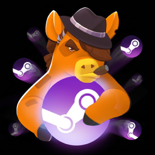

полевой мануал · издание 2026

# STEAMиздат

Как издать игру в Steam — для усталого инди, который чинит билд в два часа ночи. Регистрация, банки, маркетинг, цены.

<a class="izd-cta" href="01-start/">:material-rocket-launch-outline: С чего начать</a>
<a class="izd-cta izd-cta--ghost" href="https://t.me/+qWcZc4g1arRhMGY6" target="_blank" rel="noopener">:fontawesome-brands-telegram: Чат сообщества</a>
<a class="izd-cta izd-cta--ghost" href="https://docs.google.com/document/d/13ixSDRWBKVSOvHVhKyeZyaNXmrybOxEIuL-NImMLSD8/edit?tab=t.0" target="_blank" rel="noopener">:material-book-open-variant: Библия маркетинга</a>
<a class="izd-cta izd-cta--ghost" href="/steam-izdat-guide.pdf">:material-file-download-outline: Скачать PDF</a>

## С чего начать — по твоей ситуации

Не знаешь, в какой раздел тебе? Выбери, что про тебя сейчас — это самые частые ситуации, с которыми приходят в [чат STEAMиздат](https://t.me/+qWcZc4g1arRhMGY6).

- :material-rocket-launch-outline:{ .izd-ic } [Впервые публикую игру в Steam](01-start/index.md)Регистрация, слот $100, налоговая форма W-8BEN, первая страница «Coming Soon» — по шагам.
- :material-bank-outline:{ .izd-ic } [Куда придут деньги — выбери страну](banks/index.md)Россия, Казахстан, Армения, Грузия и др.: какой банк принимает выплаты Valve, ИП или физлицо, налоги, чем оплатить слот.
- :material-bullhorn-outline:{ .izd-ic } [О моей игре никто не знает](04-marketing/index.md)Когда начинать маркетинг, оформление страницы, капсула, теги, вишлисты, трафик.
- :material-party-popper:{ .izd-ic } [Готовлю демо или иду на фестиваль](04-marketing/fest-calendar.md)Демо, Steam Next Fest, календарь фестов 2026 — как и когда участвовать.

:material-alert-octagon: **Если ты в России, на Июнь 2026:** Челябинвестбанк под санкциями и со Steam не работает. Физлицам и самозанятым РФ-банка для выплат не осталось — рабочий вариант только Райффайзен (для ИП). [Подробнее → Россия](02-russia/index.md)

## Карта гайда

Весь гайд — четыре раздела. Жми по нужному.

- :material-rocket-launch-outline:{ .izd-ic } [Старт](01-start/index.md)Регистрация, слот $100, W-8BEN, первая страница «Coming Soon».
- :material-bank-outline:{ .izd-ic } [Деньги и страны](banks/index.md)[Банки по странам](banks/index.md) · [Релокация и нерезидентство](03-other-countries/index.md) · [Цены и финансы](05-pricing/index.md)
- :material-bullhorn-outline:{ .izd-ic } [Продвижение](04-marketing/index.md)[Маркетинг](04-marketing/index.md) · [Страница в Steam](04-marketing/store-page.md) · [Фестивали](04-marketing/festivals.md) · [Статистика](06-statistics/index.md)
- :material-lifebuoy:{ .izd-ic } [Справка](07-tools/index.md)[Инструменты](07-tools/index.md) · [Проблемы и ошибки](08-problems/index.md) · [Термины](09-terms/index.md)
- :material-calculator-variant-outline:{ .izd-ic } [Калькуляторы](calc/index.md)Считают прямо в браузере: сколько дойдёт до счёта с продажи — и не только.

## Частые вопросы — короткий ответ и куда смотреть

Самое частое, что спрашивают новички в чате. Жми на вопрос.

Сколько стоит опубликоваться?

$100 за игру (Steam Direct Fee, «слот»). Возвращается, когда игра заработает $1000. → [С чего начать](01-start/index.md)

Чем оплатить слот, если карта РФ не проходит?

Сменить регион Steam-аккаунта на страну карты и платить зарубежной картой; либо через друга за рубежом. → [Россия](02-russia/index.md)

Какой банк примет выплату от Valve?

В РФ — только Райффайзен (ИП/ООО). По остальным странам — сводная таблица статусов. → [Банки по странам](banks/index.md)

Физлицом или ИП регистрироваться из РФ?

Физлицам и самозанятым рабочего РФ-банка сейчас нет — для приёма выплат нужен статус ИП (через Райф) или зарубежная юрисдикция. → [Россия](02-russia/index.md)

Как убрать 30% налога США?

Указать TIN (ИНН) в форме W-8BEN. Ставка зависит от страны резидентства: РФ — 30%, Казахстан — 10%, Грузия и Армения — 0%. → [С чего начать](01-start/index.md)

Сколько вишлистов нужно к релизу?

Ориентир — 10 000+ как база для видимости и email-уведомлений. С июня 2026 «Популярные ожидаемые» ужесточились (теперь для крупных релизов), нишевые инди продвигает персональный календарь Steam. → [Маркетинг](04-marketing/index.md)

Когда выпускать демо и за сколько открывать страницу?

Демо — зависит от цели (разбор-развилка в маркетинге). Страницу открывай минимум за 2 недели до релиза по правилам Steam, но для вишлистов — за 6+ месяцев. → [Маркетинг](04-marketing/index.md)

:material-book-open-variant: **Библия маркетинга.** Большой community-документ [«Маркетинг инди игр»](https://docs.google.com/document/d/13ixSDRWBKVSOvHVhKyeZyaNXmrybOxEIuL-NImMLSD8/edit?tab=t.0) — его годами ведут опытные участники сообщества STEAMиздат. Внутри накопленный опыт: анонс игры, Reddit, фестивали, конверсии, письма блогерам и многое другое.

Авторов у документа много — это сборник опыта разных участников, поэтому на один и тот же вопрос там нередко встречаются разные, иногда противоположные рекомендации. Это нормально: бери его как набор проверенных практик, а не как единственно верную инструкцию — что сработало у одного, не обязательно сработает у тебя.

:material-account-edit: **От автора.** Гайд ведёт [Дмитрий Зайцев](https://t.me/dima_zaitsev_gamedev) — Telegram-канал про геймдев без издателей. Его база знаний по геймдизайну и разработке инди-игр: [indie-gamedev-knowledge-base](https://dim-s.github.io/indie-gamedev-knowledge-base/).

:material-update: **Это живой документ.** Steam меняет алгоритмы, санкции и банковские обходы мутируют. Гайд ведёт редакция STEAMиздат и держит актуальным. Нашёл устаревшее или ошибку — пиши в [чат STEAMиздат](https://t.me/+qWcZc4g1arRhMGY6) или предложи правку в репозитории (карандаш вверху страницы).

